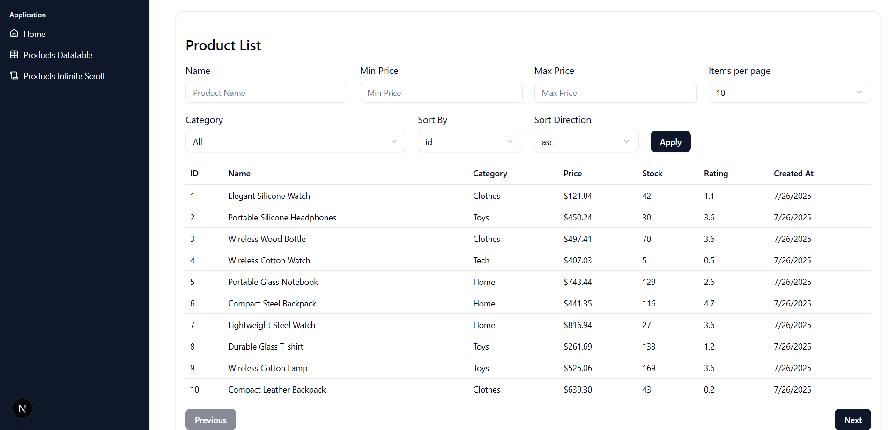
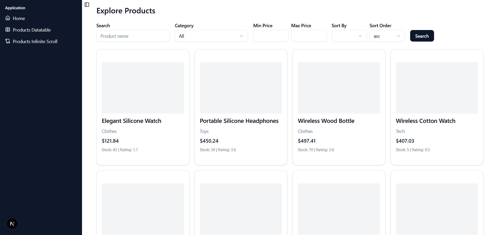

# Product Sample Dashboard (Next.js)

This frontend project is the user interface for the [FastAPI backend project](https://github.com/LinThitHtwe/dashboard-fastapi-backend). It utilizes **TanStack Query** to optimize API calls and improve performance. The project demonstrates how to handle large datasets efficiently using both a **data table** and an **infinite scroll** layout, similar to real-world e-commerce applications.

## Features

- A data table with multiple filters such as category, price range, and sorting order.
- An infinite scroll page that simulates how large datasets are handled in real-world projects using paginated API calls.

## Development Focus

- Efficient frontend data handling using TanStack Query.
- Demonstrating two approaches to presenting large datasets: structured data tables and user-friendly infinite scroll.
- Building responsive UI using Tailwind CSS and shadcn/ui components.

## Project Screenshots

**Data Table Page**


**Infinite Scroll Page**


## Backend Project

[https://github.com/LinThitHtwe/dashboard-fastapi-backend](https://github.com/LinThitHtwe/dashboard-fastapi-backend)

## Configuration & Setup

Below are the steps to run this project locally

### 1. Clone the Repository

```bash
git clone https://github.com/LinThitHtwe/dashboard-nextjs-frontend
cd dashboard-nextjs-frontend
```

---

### 2. Install Dependencies

```bash
npm i
```

---

### 3. Setup Environment Variables

Create a `.env` file in the root directory and add the following variables:

```env
BACKEND_URL=your-backend-url
```

---

### 5. Start the Project

```bash
npm run dev
```

Visit: [http://localhost:3000](http://localhost:3000) in the browser to see the result

---
